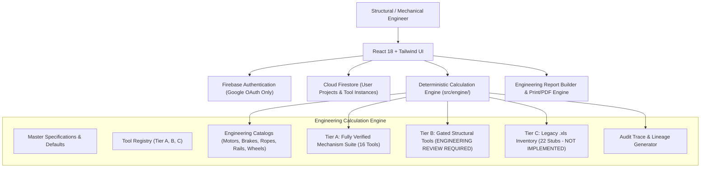

# StaticaLabs EOT Crane Engineering Platform (MVP)

A deterministic, client-side, browser-based engineering calculation suite for Electric Overhead Traveling (EOT) and Gantry cranes, built strictly according to IS 3177 / IS 807 standards and reverse-engineered from verified engineering design workbooks.

---

## 1. System Architecture & Overview

StaticaLabs EOT operates as a fully client-side single-page application (SPA) with no custom backend calculation server. All mathematical evaluations, catalog lookups, and unit conversions execute deterministically in the client runtime.



### Core Architectural Pillars
- **Zero Hallucination / Zero Fabrication:** Engineering formulas are translated verbatim from verified spreadsheets (`01-MAC-CRANE MECHANISM CALCULATION-IS3177-INDOOR.xlsx`). Formulas not mathematically proven or from unverified legacy files are explicitly gated with `ENGINEERING REVIEW REQUIRED` or `NOT IMPLEMENTED`.
- **Pure Numerical Derivation:** Results and statuses (`PASS` / `FAIL` / `WARNING`) are computed dynamically from actual engineering values, never hardcoded from narrative notes.
- **Traceability:** Every calculated parameter preserves its mathematical formula, symbolic equation, substituted numerical step, reference standards (IS 3177 / IS 807), and spreadsheet source lineage (workbook, sheet, and cell coordinates).

---

## 2. Calculation Suite Tiers

### Tier A: Core Mechanism Suite (Fully Verified & Automated)
The 16 core mechanism calculation tools are fully implemented and verified against golden fixture benchmarks:
1. **Main Hoist Motor** (`mainHoistMotor.ts`) — IS 3177 Clause 19 power, motor selection, and duty factors.
2. **Main Hoist Brake** (`mainHoistBrake.ts`) — Brake torque factor and shoe brake selection.
3. **Wire Rope Selection** (`wireRope.ts`) — Rope diameter, breaking load, and factor of safety.
4. **Rope Drum Design** (`ropeDrum.ts`) — Pitch diameter, pitch, thickness, groove radius, and active turns.
5. **Hoist Gearbox** (`hoistGearbox.ts`) — Total reduction ratio, drum RPM, and motor speed matching.
6. **Hoist Sheaves** (`sheaves.ts`) — Sheave diameter ratios for rope diameter.
7. **Cross Travel Motor** (`crossTravelMotor.ts`) — Rolling resistance, acceleration power, and motor rating.
8. **Cross Travel Brake** (`crossTravelBrake.ts`) — CT braking torque requirements.
9. **Cross Travel Wheels** (`crossTravelWheel.ts`) — Wheel load, diameter, and contact stresses.
10. **Cross Travel Gearbox** (`crossTravelGearbox.ts`) — CT travel ratio and speed verification.
11. **Long Travel Motor** (`longTravelMotor.ts`) — Bridge rolling resistance, wind/acceleration force, and motor kW.
12. **Long Travel Brake** (`longTravelBrake.ts`) — LT braking torque requirements.
13. **Long Travel Wheels** (`longTravelWheel.ts`) — Bridge wheel load distribution, mean wheel load, and wheel RPM.
14. **Long Travel Gearbox** (`longTravelGearbox.ts`) — Ratio matching and travel speed verification (**Critical regression test**).
15. **Crab Weight Estimation** (`crabWeight.ts`) — Mechanism deadweight tally and factored crab weight.
16. **Wheel / Rail Hardness Check** (`wheelRailHardness.ts`) — Wheel tread BHN vs rail BHN (**Discrepancy review gate**).

### Tier B: Structural Suite (Gated — Review Required)
Structural tools require thorough FEA and cross-section validation under IS 807. These tools provide placeholder interfaces and are strictly gated:
- `boxBeamProperties` — Box girder sectional properties ($I_{xx}$, $I_{yy}$, $Z_{xx}$).
- `bendingMoment` — Maximum vertical and horizontal bending moments on bridge.
- `gantryGirder` — Runway gantry girder stress analysis.
- `gantryLeg` — Portal and gantry leg column buckling checks.

*Status: Marked as `ENGINEERING REVIEW REQUIRED` with check status `WARNING`.*

### Tier C: Legacy .xls Inventory (22 Unverified Modules)
Legacy workbooks in `.xls` format (prior to 2007) containing unverified macros, ambiguous cellular references, or obsolete empirical factors have been inventoried into 22 stub tools in `src/engine/legacy/legacyInventory.ts`.
- These modules **never** fabricate formulas or silently guess coefficients.
- Each stub records the exact source file and sheet reference.
- Any attempt to run calculations returns check status `WARNING` and warning `"CALCULATION NOT IMPLEMENTED: Formula requires formal re-derivation from primary standards (IS 3177 / IS 807)."`.

---

## 3. Critical Regressions & Engineering Discrepancies

### Critical Regression 1: Long Travel Gearbox Ratio Failure
- **Workbook cell:** `L.T.!G87` (Speed = 25.136 m/min vs required 20.0 m/min).
- **Behavior:** With standard 4-pole motor (860 RPM), wheel diameter 200 mm, and selected gearbox ratio 21.5, actual bridge speed computes to:
  $$V_{actual} = \frac{860 \times \pi \times 0.200}{21.5} \approx 25.136 \text{ m/min}$$
- The permissible window ($20 \pm 10\%$) is $18.0 \text{ to } 22.0 \text{ m/min}$.
- **Result:** The system derives `FAIL` (`CHK-LT-SPEED-TOLERANCE`), rejecting narrative spreadsheet cells that falsely labeled this as "OK". Covered by automated Vitest regression test `tests/engine/goldenFixtures.test.ts`.

### Engineering Discrepancy 2: Wheel/Rail Hardness Mismatch
- **Workbook sheet:** `HARDNESS-BHw,BHr`.
- **Behavior:** The theoretical hardness formula yields $\approx 284.91 \text{ BHN}$, but the workbook specifies a minimum recommended hardness of $300\text{--}350 \text{ BHN}$.
- **Result:** The system flags this with a `WARNING` check and an explicit engineering review notice rather than silencing the variance.

---

## 4. Local Setup & Verification

### Prerequisites
- Node.js 18+ (tested on Node v20 LTS)
- npm 9+
- Firebase CLI (for Firestore rules deployment)

### Installation
```bash
git clone https://github.com/angelmacwan/statica-eot.git
cd statica-eot
npm install
```

### Running Tests (Vitest)
Unit tests, invariant checks, and golden workbook fixtures run instantly via:
```bash
npm run test
```
All 21 test suites must pass (16 golden fixtures + 5 invariants/validations).

### Running Lint
```bash
npm run lint
```

### Building for Production
```bash
npm run build
```
Executes `tsc` type-checking and `vite build`. Production assets are output to `dist/`.

> **Note on Local Development:** In automated agent environments, `npm run dev` is intentionally disabled. For interactive local human development in browser, `npm run dev` runs Vite on port 5173.

---

## 5. Firebase Setup & Security

The project connects to Google Firebase for authentication and persistence.

### Client-Side Environment Variables
Create a `.env` or `.env.local` file with your Firebase web configuration:
```env
VITE_FIREBASE_API_KEY=AIzaSy...
VITE_FIREBASE_AUTH_DOMAIN=statica-eot.firebaseapp.com
VITE_FIREBASE_PROJECT_ID=statica-eot
VITE_FIREBASE_STORAGE_BUCKET=statica-eot.firebasestorage.app
VITE_FIREBASE_MESSAGING_SENDER_ID=...
VITE_FIREBASE_APP_ID=1:...
```

### Firebase Security Rules
Firestore security rules in `firestore.rules` enforce strict per-user authorization:
- Unauthenticated requests are rejected (`request.auth != null`).
- Users can only read, create, update, or delete projects and tool instances where `request.auth.uid == resource.data.ownerUid`.
- Tool instance subcollections verify parent project ownership.

To deploy security rules and indexes:
```bash
firebase use statica-eot
firebase deploy --only firestore:rules,firestore:indexes
```

---

## 6. Report Generation & Print Engine

The platform includes a dedicated **Engineering Report Builder** (`/projects/:projectId/report`):
- Multi-module selection for unified compilation.
- Step-by-step mathematical trace views with rendered formulas and substituted values.
- Check tables verifying compliance with IS 3177 and IS 807 allowable limits.
- Complete workbook/sheet/cell source lineage displayed for every module.
- Print-optimized CSS (`@media print`) for producing PDF submittals without navigation chrome or screen artifacts.

---

## 7. License & Compliance

Designed and implemented in accordance with Indian Standards:
- **IS 3177 (1999):** Code of Practice for Electric Overhead Travelling Cranes.
- **IS 807 (2006):** Design, Erection and Testing (Structural Portion) of Cranes and Hoists.
